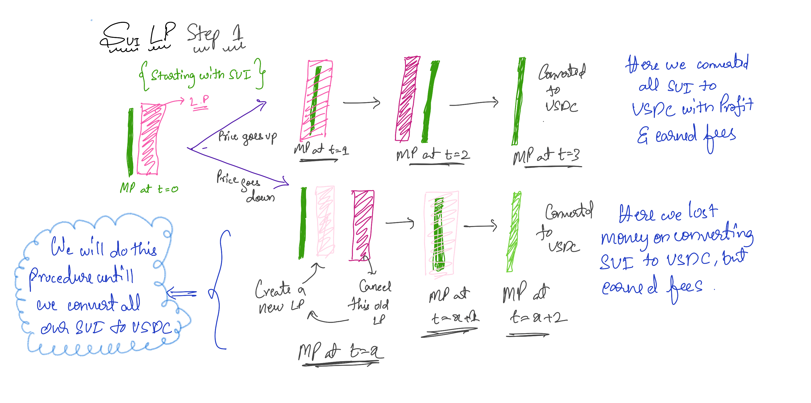
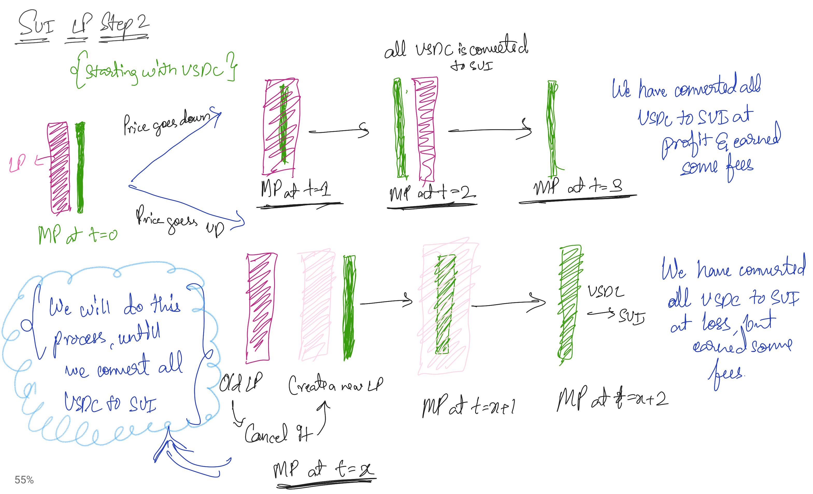
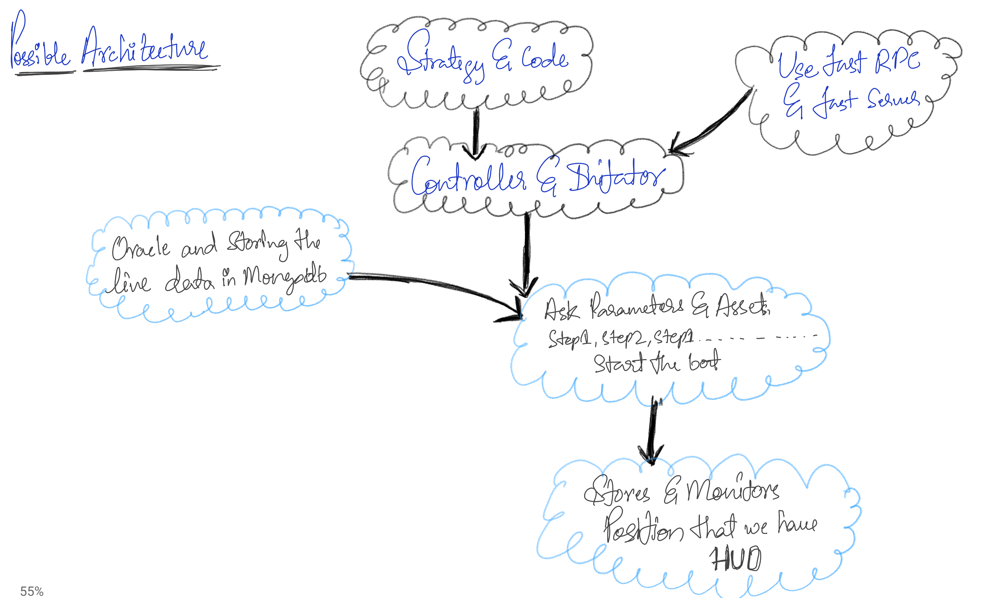
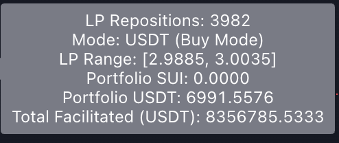
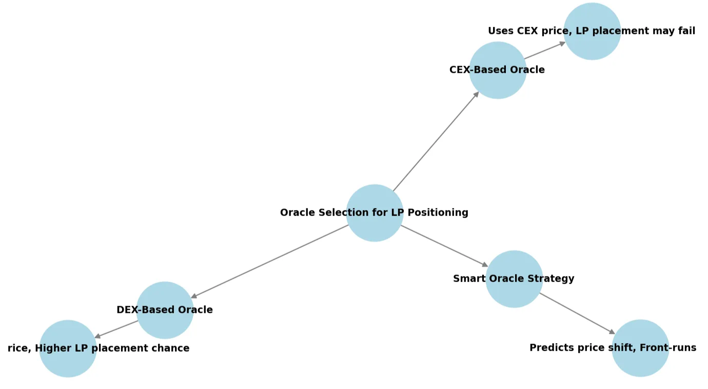

# SUI LP Automation- V1.1 docs

Dividing the Doc into 5 parts

1.Logic
   1.1 **Step 1: Converting SUI to USDC**
   1.2 **Step 2: Converting USDC to SUI**
2.Architecture
3.Strategy Details 
   3.1 Parameters for Initial run V1.1
   3.2 Complementary Bot Strategy
   3.3 Oracle and Predicted LP
4.MVP Repo
5.Experiment Criteria 
6.Resources for Execution 

# 1.Logic

## **1.1 Step 1: Converting SUI to USDC**

### **Initial Setup**

- The process begins with holding SUI.
- A liquidity position (LP) is established in a predefined price range.
- The strategy follows two possible market conditions:
    1. **Price Goes Up**
        - The LP's SUI is converted into USDC as the price rises.
        - Over time, the entire liquidity position shifts to USDC.
        - Once the conversion is complete, the LP is closed, and the USDC balance is retained.
        - **Outcome:** Profit is realized alongside earned trading fees.
    2. **Price Goes Down**
        - The LP retains SUI, but at a lower market price.
        - The older position is closed, and new position is opened for LP with adjusted price level, we do this strategy until the LP pool gets converted
        - However, we do convert SUI to with Loss, but trading fees are still accrued during the process.
        - To continue the strategy, a new LP is created at the adjusted price level.
        - **Outcome:** A loss is incurred, but fees help mitigate it.

### A Visual description for step 1

## **1.2 Step 2: Converting USDC to SUI**

### **Initial Setup**

- This step mirrors Step 1 but starts with USDC instead of SUI.
- The liquidity position is established within a predefined price range.
- Again, two market conditions dictate the strategy’s outcome:
    1. **Price Goes Down**
        - The LP's USDC is converted into SUI as the price declines.
        - The entire liquidity position eventually shifts to SUI.
        - Once complete, the LP is closed, and the SUI balance is retained.
        - **Outcome:** Profit is realized, and fees are earned.
    2. **Price Goes Up**
        - The LP retains USDC, but at a higher market price.
        - The position is closed at a loss.
        - Trading fees are still accrued, helping reduce the loss.
        - A new LP is created at the adjusted price level to continue the process.
        - **Outcome:** Loss is incurred, but fees partially compensate.

### A Visual description for step 2

---

Quick Heads up, When you trade in CEX/DEX you lose money as fees for swapping, but using LP as a tool for swapping you make the fees and this is the core LOGIC of this Strategy.

# **2.Possible Architecture**

### **Overview**

This document outlines a high-level architecture for an automated liquidity provisioning bot, detailing its core components and interactions. The system integrates a **strategy execution module**, **controller**, **data storage**, and **monitoring framework**, leveraging **MongoDB for live data storage** and custom **RPC for seamless blockchain interactions**.

---

### **Core Components & Functionality**

1. **Strategy & Code**
    - Houses the core trading or liquidity provisioning logic.
    - Defines execution rules based on predefined parameters.
2. **Controller & Director**
    - Acts as the main execution hub, directing the flow between different modules.
    - Interfaces with external services like Custom paid RPC and Serial for blockchain communication.
    - Queries market data and manages transaction execution.
3. **Oracle & MongoDB Integration**
    - Fetches **real-time market data** through an Oracle service(from bluefin for the actual price of the SUI in that particular LP).
    - Stores live data in **MongoDB** for historical tracking and analytical purposes.
    - Ensures **data persistence and availability** for decision-making.
4. **Parameter & Asset Management**
    - Requests and processes **user-defined parameters** such as asset selection, risk thresholds, and execution steps.
    - Initializes the bot based on structured **Step 1, Step 2, Step 1, step 2 …** flow.
5. **Position Monitoring & HUD (Heads-Up Display)**
    - Tracks **open positions** and their market impact.
    - Provides a **real-time dashboard** (HUD) for visualizing system performance.
    - Ensures transparency and control over automated execution.

---

### **Key Takeaways**

✅ **Modular Design**: Each component has a clear role, making the system scalable and adaptable.

✅ **Live Data Storage**: MongoDB enables **efficient historical tracking and analysis**.

✅ **Blockchain Interaction**: Custom RPC ensures **fast and reliable** communication with on-chain protocols.

✅ **Position Monitoring**: The HUD feature enhances real-time **risk management and strategy adjustments**.

---

### A Visual representation of the possible architecture

# 3.Strategy Details and Parameters

Our core objective is to **buy low and sell high**, but in the context of **high-frequency liquidity provisioning (LP) with a tight range around the market price**, this ideal scenario isn't always guaranteed. As outlined in **Step 1 and Step 2**, we will inevitably experience both **profits and losses** throughout the execution cycle.

The **primary goal** of this strategy is to **continuously cycle between Step 1 and Step 2**, generating substantial **trading volume** to **maximize LP fees**. The process follows a **looped execution**:

- If initiated with **Step 1**, the strategy must **proceed to Step 2**, then **return to Step 1**, and repeat **indefinitely** until a manual stop is triggered by the operator.

At first glance, new readers might question the feasibility of this approach. However, recent **backtests on moderately volatile assets** indicate that **capital drawdowns remain controlled**. The losses are **gradual and proportional to market movements**—if the market shifts by **20%**, our exposure adjusts accordingly, without extreme capital erosion.

This strategy is **best suited for assets with consistent volatility**, allowing us to **capitalize on volume-driven fee farming** while mitigating risks through **strategic LP management**.

Attaching a hypothetical model which runs on 100% efficiency, the $10000 invested to LP in SUI/USDC in the same order mentioned above, would have generated $8.3M in volume in last 39 days from 1st January 2025 to 9th February 2025. I have attached a Notion doc to read more about this tradingview Pine script ‣ 

We started with $10k and did end with a lose of $3k in total but it is equivalent what we have lost in SUI value which is -28% from Jan 1st price, but in this time period we did a volume of $8.35M which would have earned us fees at $16k at the pool fee rate of 0.20%, which goes with 1600% APY.

We could maximise this return by LP in high fee pools and trading frequently.

<aside>
💡

IGNORE THE 3.1, (A new version is available)

</aside>

## 3.1 Parameters for Initial run V1.1

Archived thoughts 

[Archived 1.1](https://www.notion.so/Archived-1-1-1dcdbcb1f2268169b293e90ee445ac70?pvs=21)

3.1.1 We will focus on tickers instead of percentage, we can get the exact ticker from the bluefin [https://bluefin-exchange.readme.io/reference/spot-api-getpoolsinfo](https://bluefin-exchange.readme.io/reference/spot-api-getpoolsinfo) 

For STEP 1 we can do this experiment (SUI to USDC)

1. If mark price is X, Go and do an LP from the next available ticker which is ticker+1 to next+2 and rebalance if the MP go beyond the average of next+3 and next+4 ticker, close the LP position. And for rebalancing the MP goes beyond the average of Ticker-1 AND Ticker-2, then we will cancel our LP and create a LP at ticker -1 to ticker +2

Note, in this strategy I havent used the notation of Ticker+0.

1. Step-2, Here If we have USDC, we will try to convert it to SUI, So the MP is X, we will create a LP from ticker-1 to Ticker-3 and close at the average price at average price of ticker-3 and ticker-4. Rebalnace the strategy just like STEP 1 if the MP crosses the price of Ticker+1 and ticker+2. And then you cancel the older one and make a new one at ticker-2 to ticker+1, here we should change the rebalanacing and close function appropriately.

2. FINAL STRATGEY, if we start with STEP1, then after its close, STEP2 should start and when its closed, we will open STEP1 and this loop will follow till the operator closes the bot.

## 3.2 Complementary  Strategy— (ignore)

This strategy leverages two complementary bots to maximize LP fee farming while reducing directional risk. One bot converts **SUI → USDC**, while the other converts **USDC → SUI**, ensuring continuous liquidity provisioning. Given the **50-50 probability** of price movement, one bot always benefits, while the other mitigates losses through earned fees(but its ok to take loss, we will make fees>>>capital). This approach ensures **consistent volume generation**, making it ideal for moderately volatile assets while sustaining market participation and optimizing fee accumulation.

Also all the rewards that we get, must be converted to sSUI and deposited to Suilend once in 24hr. So its important to track the amount of SUI/USDC in the pool at any required time.

## 3.3 Oracle and Predicted LP

---

**Optimal Oracle Selection for LP Positioning: An Experiment Proposal**

Ideally, using the pool's current price as the Oracle would be the best approach. However, a significant portion of DEX trading volume is driven by arbitrage, where the **price action is dictated by CEX movements**. This raises a critical question—should the Oracle be based on the **DEX price** or the **CEX price** to ensure optimal liquidity provision?

### **Proposed Experiment:**

We explore two different Oracle approaches to determine the best way forward:

1. **DEX-Based Oracle:**
    - Uses the current price of the DEX asset pool as the Oracle and data feed.
    - **Advantage:** Higher probability of getting an LP position placed on either side of the range.
2. **CEX-Based Oracle:**
    - Uses the current price of the CEX asset pair as the Oracle and data feed.
    - **Challenge:** If the pool's mid-price (MP) on the DEX is $4 while the CEX price is $4.1, the LP position for USDC/SUI may not get placed under the current logic.
    - This occurs because the algorithm expects the LP position to be placed at $4, but since the MP is still at $4 at that moment, the system doesn’t execute the order.

### **Smart Oracle Adjustment:**

To stay ahead of arbitrage bots, we can modify our approach:

- If the CEX price of SUI is $4.1 at **t = 0**, we can predict that the **DEX price will soon adjust to $4.1** due to arbitrage.
- Instead of waiting for arbitrageurs to act, we should **front-run this movement by placing the LP order before the arbitrage bots execute their swaps**.
- This effectively turns LP placement into a **latency-sensitive strategy**, where faster execution can capitalize on inevitable price convergence between CEX and DEX.

By implementing this **Smart Oracle**, we can optimize LP positioning and improve the efficiency of liquidity provision in volatile market conditions.

# 4.MVP Repo

I tried to do a mini MVP, which tries to place LP positions using the Oracle from DEX(bluefin) and executes SUI to USDC LP pools and rebalances according to logic. This repo was build to show the possibility of a MVP.

Link to repo - [https://github.com/npcgroup/Venky-sui-demo](https://github.com/npcgroup/Venky-sui-demo)

Link to SUI explorer- (here the bot did add liquidity and rebalanced it and closed it)

But I would recommend to take hummingbot as the reference for Tech building as they have figured out in a structured way.

# 5. Experiment Criteria

Model 1 - Run complementary bot for mentioned Ranges using DEX pool as ORACLE ( there are 2 pools for SUI/USDC on bluefin, we can run on both simultaneously and check which generated more fees)
Model 2- Run complementary bot for mentioned Ranges using CEX pair as ORACLE

Model -3 Run complementary bot for mentioned Ranges using smart ORACLE data feed (future project) 

Track Sheet - https://docs.google.com/spreadsheets/d/1sycmh3Vc4dlMBBJSU4etipU0ZcUoiD1N3iJDtTH5XD8/edit?usp=sharing

# 6.Resources Reference

For Bluefin and Oracle for DEX → [https://bluefin-exchange.readme.io/reference/introduction](https://bluefin-exchange.readme.io/reference/introduction) 
For Bot reference - Hummingbot arch is inspiring → https://github.com/hummingbot/hummingbot 

For CEX oracle- Binance API 

Potential roadblock for this project - API rate limit, server latency.

# 7.Important Fact

Also, If we are apeing into a pool of 0.10% then minimum ticker of that pool is 0.1%, so our LP pool width with must be >>> 0.2% and also the conversion shift should be greater than 0.1%, so this is also a important thing while deploying. I have added this criteria into TradingView!

lower limit of LP
Upper limit of LP
rebalance point
Close LP

MP
7

Sui- 3.5 ,,,, LL- 3.55 to UL to 3.60, rebalance- 3.50 and close will be at 3.65

Step 1
3.66>> 3.65, u will close the LP, and u have USDC
3.49<<<3.50, u will rebalnce 3.51 to 3.56, close LP at 3.60 and rebalnce as 3.45

3.449<<3.45, u will rebalnce to 3.46 to 3.51, close LP at 3.55 and rebalnce at 3.40

[In-range implementation](https://www.notion.so/In-range-implementation-1dcdbcb1f22681aa82e1ed965e38169f?pvs=21)